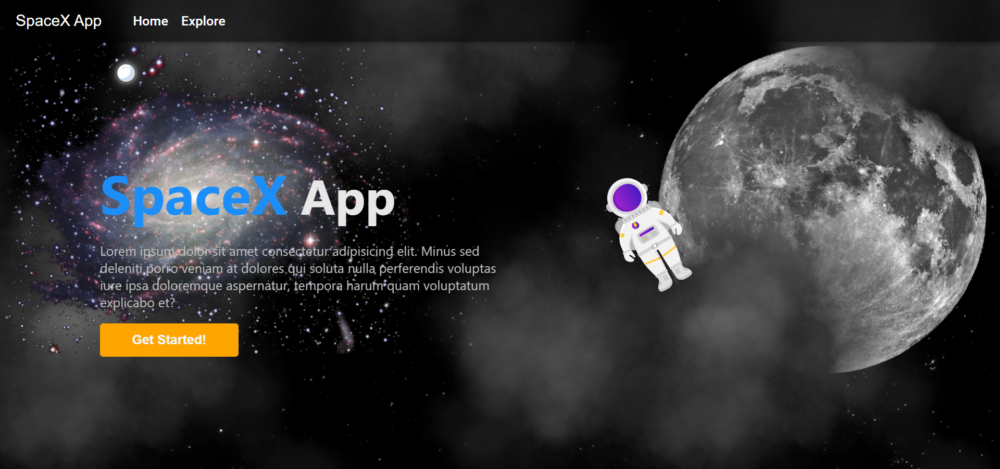
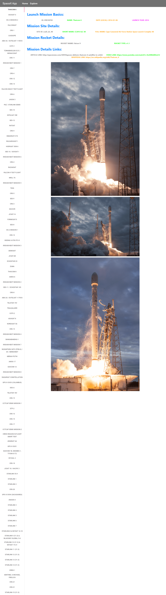

# 👨‍💻 React SpaceX App (Progressive Web App).
## 📽 A project based on Panacloud React Bootcamp [Project 8].

### ⚒ Project Demo:
####  For Project Demo Follow the Link: http://spacex-react.surge.sh/

### 🕵️‍♂️ Project Details:
####  This project is based on primarily on React TypeScript as well as uses other libraries too and it follows Test-Driven-Development. In this app, you can use see space shuttles details!

### ⚙ Technical Details:
#### In this project, React with TypeScript is used for the project. Other Libraries used includes Material-UI, Jest, Enzyme, Apollo, Graphql and React-Router.

### 🤹‍♂️ Skill:
&nbsp;&nbsp;&nbsp;&nbsp;
&nbsp;&nbsp;&nbsp;&nbsp;
&nbsp;&nbsp;&nbsp;&nbsp;
&nbsp;&nbsp;&nbsp;&nbsp;
&nbsp;&nbsp;&nbsp;&nbsp;
&nbsp;&nbsp;&nbsp;&nbsp;
&nbsp;&nbsp;&nbsp;&nbsp;
&nbsp;&nbsp;&nbsp;&nbsp;

### ✔ Contributers:

  <a href="https://github.com/faraasat">
    &nbsp&nbsp&nbsp&nbsp&nbsp&nbsp&nbsp&nbsp&nbsp&nbsp&nbsp&nbsp
  </a>

### 📷 Project UI:

  <a href="http://spacex-react.surge.sh/">
    &nbsp&nbsp&nbsp&nbsp&nbsp&nbsp&nbsp&nbsp&nbsp&nbsp&nbsp&nbsp
  </a>

  <a href="http://spacex-react.surge.sh/">
    &nbsp&nbsp&nbsp&nbsp&nbsp&nbsp&nbsp&nbsp&nbsp&nbsp&nbsp&nbsp
  </a>

